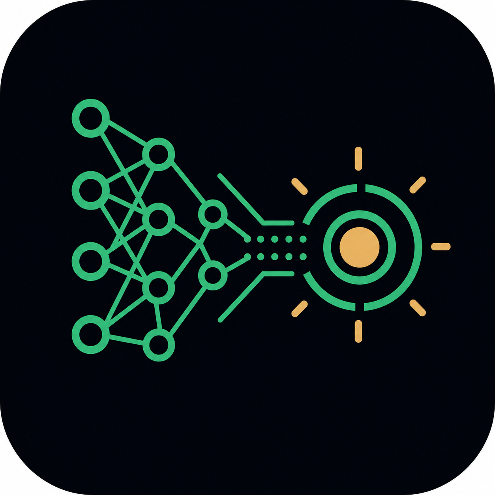
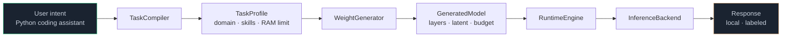
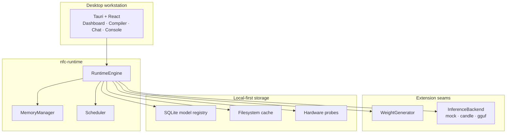
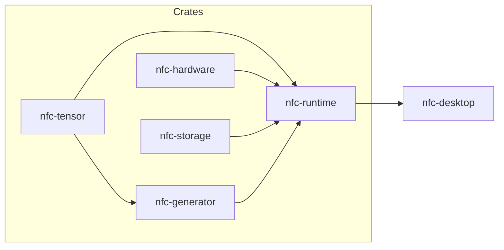

<p align="center">
  
</p>

<h1 align="center">NFCM</h1>

<p align="center">
  <strong>Neural Foundation Compression Model</strong><br/>
  A local AI runtime that builds the <em>right</em> model for the job — on your machine, under your RAM budget.
</p>

<p align="center">
  <a href="LICENSE"></a>
  <a href="nfc-runtime/Cargo.toml"></a>
  <a href="nfc-runtime/apps/desktop"></a>
  <a href="CONTRIBUTING.md"></a>
</p>

---

## Why NFCM?

Shipping a 30B+ general LLM to every device is wasteful. Most sessions only need a **coding**, **math**, or **research** specialist — and they need to fit in limited RAM.

NFCM explores a different path: keep knowledge compressed, **compile** a task profile, **generate** a specialist subnetwork at runtime, and run it **locally** with memory you can see and control.

Not another cloud chatbot wrapper — a workstation for neural compression and dynamic capability.

---

## Idea in one picture



Long-term research target: a small stored foundation that can materialize task-specific brains on demand (the “32B-class capability on low memory” vision). The platform you can run today is the plug-in surface for that work.

---

## Architecture



| Layer | Role |
|-------|------|
| **Desktop** | Local workstation UI (no cloud required) |
| **RuntimeEngine** | Load / unload / infer / optimize |
| **WeightGenerator** | Task profile → model artifact (mock today; hypernetwork later) |
| **InferenceBackend** | Mock, optional Candle, GGUF via llama.cpp |
| **Storage + hardware** | Registry, cache, CPU/RAM/GPU awareness |

---

## What works today

| Capability | Notes |
|------------|--------|
| Rust workspace | `tensor` · `hardware` · `storage` · `generator` · `runtime` |
| Task compiler | Intent → domain, skills, memory limit |
| Mock weight generation | Exercises the full compile → load → chat loop |
| Memory manager | Soft budgets (generator / active model / cache) |
| Model registry | SQLite + on-disk descriptors |
| Desktop app | Dashboard, Models, Compiler, Console, Chat, Dev Tools |
| Backend seams | Mock default; Candle feature; GGUF CLI adapter |

Mocks are labeled (`is_mock: true`). No fake production-LLM claims.

---

## Repo map

```text
nfcm/
├── nfc-runtime/          # Rust crates + Tauri desktop
│   ├── apps/desktop/
│   ├── crates/
│   └── experiments/      # Research sandbox
├── docs/                 # Deep documentation
├── assets/logo/          # Brand mark
└── branding/             # Derived icon sizes
```



---

## Status

| Area | State |
|------|--------|
| Runtime + desktop platform | Ready to explore |
| Mock generator & inference | Working (labeled) |
| Candle / GGUF adapters | Scaffold / env-driven |
| Real hypernetwork compressor | Open research |

---

## Principles

- **Local-first** — core path has no cloud dependency  
- **Honest labeling** — mock ≠ trained model  
- **Clean seams** — swap generators/backends without rewriting the UI  
- **Memory-aware** — budgets you can inspect and control  
- **Open** — MIT, contributions welcome  

---

## Documentation

| Doc | What you’ll find |
|-----|------------------|
| [Getting started](docs/getting-started.md) | Install, build, run (quick start lives here) |
| [Architecture](docs/architecture.md) | Design and seams |
| [Inference backends](docs/inference-backends.md) | Mock / Candle / GGUF |
| [Research roadmap](docs/research-notes.md) | Next scientific steps |
| [Structure](docs/STRUCTURE.md) | Full file tree |
| [Contributing](CONTRIBUTING.md) | How to help, PR / CI norms |
| [Maintainer notes](docs/maintainer.md) | Branch protection, labels, Dependabot |
| [Security](SECURITY.md) | Vulnerability reporting |
| [Code of Conduct](CODE_OF_CONDUCT.md) | Community norms |
| [Changelog](CHANGELOG.md) | Release history |
| [Support](SUPPORT.md) | Where to ask questions |
| [Runtime package](nfc-runtime/README.md) | Crate-level overview |

---

## License

[MIT](LICENSE)

*NFCM is infrastructure and research software. Mock outputs are placeholders — not advice for medical, legal, or safety-critical use.*
